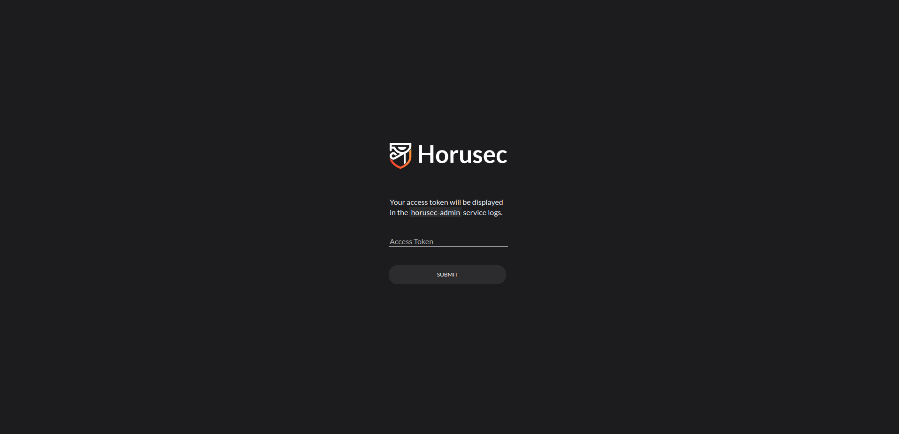
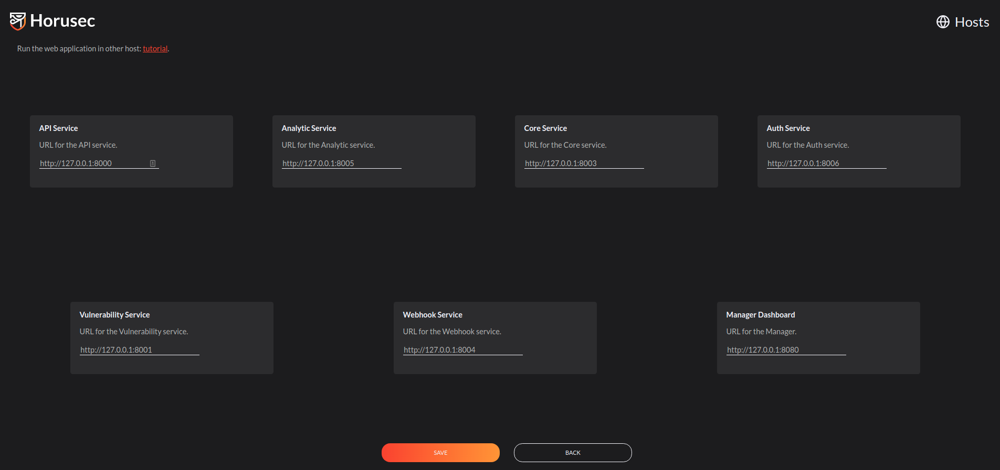

<p></p>
<p></p>
<p align="center" margin="20 0"><a href="https://horusec.io/"></a></p>
<p></p>
<p></p>

<p align="center">
    <a href="https://github.com/ZupIT/horusec-admin/pulse" alt="activity">
        </a>
    <a href="https://github.com/ZupIT/horusec-admin/graphs/contributors" alt="contributors">
        </a>
    <a href="https://github.com/ZupIT/horusec-admin/actions/workflows/lint.yml" alt="lint">
        </a>
    <a href="https://github.com/ZupIT/horusec-admin/actions/workflows/tests.yml" alt="tests">
        </a>
    <a href="https://github.com/ZupIT/horusec-admin/actions/workflows/security.yml" alt="security">
        </a>
    <a href="https://github.com/ZupIT/horusec-admin/actions/workflows/coverage.yml" alt="coverage">
        </a>
    <a href="https://opensource.org/licenses/Apache-2.0" alt="license">
        </a>
</p>

> :warning: **This project will be discontinued from October 2021.** We will leave the repository here in case the community wants to continue its development.

# Horusec-Admin
The main function of horusec-admin is to carry out basic modifications to your kubernetes cluster through a user-friendly interface.
Its creation is based in conjunction with the [horusec-operator](https://github.com/ZupIT/horusec-operator), where it can have a simpler way to install the services in an environment using kubernetes.
See all horusec admin details in [our documentation](https://horusec.io/docs/web/installation/install-with-horusec-admin/)

## Requirements
To use horusec-admin you need to configure some secrets and dependencies of horusec, they are:
* [Kubectl](https://kubernetes.io/docs/tasks/tools/#kubectl) and connection with your cluster
* [Horusec-Operator](https://github.com/ZupIT/horusec-operator) installed.

## Installing
After configuring your database connection, connecting to your broker and creating the secrets you need to install horusec-operator on your cluster, see an example below:
```bash
kubectl apply -f "https://github.com/ZupIT/horusec-operator/releases/download/v2.0.0/horusec-operator.yaml"
```
See the resource if was installed with sucess!
```bash
kubectl api-resources | grep horus
```
you can see an output like this:
```text
$ kubectl api-resources | grep horus                                                           
horusecplatforms                  horus        install.horusec.io             true         HorusecPlatform
```

And now is necessary install horusec-admin in your cluster
```bash
kubectl apply -f "https://github.com/ZupIT/horusec-admin/releases/download/v2.0.0/horusec-admin.yaml"
```

See the pod running!
```bash
kubectl get pods
```
you can see an output like this:
```text
$ kubectl get pods                                                           
NAME                                                    READY   STATUS      RESTARTS   AGE
horusec-admin-74594694f-sdmr8                           1/1     Running     0          1m
```

## Usage

**Is not possible realize changes in horusec-operator with an yaml file and you see this data in horusec-admin, is recommended usage some one project to configured horusec services. In other words, just the horusec-admin or just horusec-operator**

The Horusec-admin is running in your cluster by default in internal port http 3000 is necessary expose in your local machine to access interface this project.

**WARNING! DON'T EXPOSE THIS SERVICE TO EXTERNAL INTERNET BECAUSE CONTAINS SENSITIVE DATA !!!**

And now in your terminal start in port-forward of this service how:
```bash
kubectl port-forward horusec-admin-74594694f-sdmr8 3000:3000
```
and if you access `http://localhost:3000` you see horusec-admin page


To get this access token, is necessary see the logs of the service, because the token was showed only internal pod and renewd every 10 minutes. See follow example:
```bash
kubectl logs pod/horusec-admin-74594694f-sdmr8
```
and your output:
```text
time="2021-06-25 11:29:12 +0000" level=info msg="Token:04cd71a59715bc535cdc3ef6050c4f0ad49f12f0" prefix=authz
time="2021-06-25 11:29:12 +0000" level=info msg="Valid until:2021-06-25 13:29:12.454049573 +0000 UTC m=+7200.016119300" prefix=authz
time="2021-06-25 11:29:12 +0000" level=info msg=listening addr=":3000" prefix=server
```
The token in this case is `04cd71a59715bc535cdc3ef6050c4f0ad49f12f0`


### When you access internal pages you can see the pages:

### - Home Page
Select which configuration you want to perform on the platform


### - Status Page
Check the status of the services and if available


### - General Page
Perform general application settings such as data for users of the application among others.


### - Resources Page
Perform connection settings with services as required databases, Message Broker and SMTP.
**Remembering that Horusec does not create these features only accomplishes the connection!**


### - Authentication Page
Change the type of authentication you want to use in your environment!


### - Hosts Page
Update simply and quickly the host of your application that will be exposed in the ingress of your Kubbernetes cluster


## Development Environment
First Step is necessary you [configure horusec-operator](https://github.com/ZupIT/horusec-operator#development-environment) and all connections and secrets.

For usage this example is necessary installing [helm](https://helm.sh/docs/intro/install/#from-script) and [kind](https://kind.sigs.k8s.io/docs/user/quick-start/#installation) in your local machine
After of you install you can run follow commands and see horusec-operator up all horusec web services.

Clone horusec-operator project
```bash
git clone https://github.com/ZupIT/horusec-operator.git && cd horusec-operator
```

Up kubernetes cluster with all dependencies and wait finish!
```bash
make up-sample
```

If you see this message
```text
Creating horusec_analytic_db...
If you don't see a command prompt, try pressing enter.
psql: could not connect to server: Connection refused
        Is the server running on host "postgresql" (10.96.182.42) and accepting
        TCP/IP connections on port 5432?
pod "postgresql-client" deleted
pod default/postgresql-client terminated (Error)
```
Don't worry this is normal because the script is trying create new database, but the pod of the postgresql is not ready, it will run again until create new database.

After script finish. Install Horusec-Operator
```bash
kubectl apply -f "https://github.com/ZupIT/horusec-operator/releases/download/v2.0.0/horusec-operator.yaml"
```

See the resource if was installed with sucess!
```bash
kubectl api-resources | grep horus
```
you can see an output like this:
```text
$ kubectl api-resources | grep horus                                                           
horusecplatforms                  horus        install.horusec.io             true         HorusecPlatform
```

And you can see the pod manager by this resource
```text
$ kubectl get pods -n horusec-operator-system
NAME                                                   READY   STATUS              RESTARTS   AGE
horusec-operator-controller-manager-7b9696d4c4-t7w2q   2/2     Running             0          2m10s
```

And now is necessary install horusec-admin in your cluster
```bash
kubectl apply -f "https://github.com/ZupIT/horusec-admin/releases/download/v2.0.0/horusec-admin.yaml"
```

See the pod running!
```bash
kubectl get pods
```
you can see an output like this:
```text
$ kubectl get pods                                                           
NAME                                                    READY   STATUS      RESTARTS   AGE
horusec-admin-74594694f-sdmr8                           1/1     Running     0          1m
```

And now in your terminal start in port-forward of this service how:
```bash
kubectl port-forward horusec-admin-74594694f-sdmr8 3000:3000
```
and if you access `http://localhost:3000` you see horusec-admin page

To get this access token, is necessary see the logs of the service, because the token was showed only internal pod and renewd every 10 minutes. See follow example:
```bash
kubectl logs pod/horusec-admin-74594694f-sdmr8
```
and your output:
```text
time="2021-06-25 11:29:12 +0000" level=info msg="Token:04cd71a59715bc535cdc3ef6050c4f0ad49f12f0" prefix=authz
time="2021-06-25 11:29:12 +0000" level=info msg="Valid until:2021-06-25 13:29:12.454049573 +0000 UTC m=+7200.016119300" prefix=authz
time="2021-06-25 11:29:12 +0000" level=info msg=listening addr=":3000" prefix=server
```
The token in this case is `04cd71a59715bc535cdc3ef6050c4f0ad49f12f0`.

Setup authentication go to the page general and **click in "Save" button**, and all horusec services is upload with default configuration. You can see with command
```bash
kubectl get pods
```
you can see an output like this:
```text
$ kubectl get pods
NAME                                                    READY   STATUS      RESTARTS   AGE
horusec-admin-74594694f-sdmr8                           1/1     Running     0          5m
analytic-6f6bffb5d6-f8pl9                               1/1     Running     0          74s
api-5cc5b7545-km925                                     1/1     Running     0          73s
auth-8fbc876d9-62r6d                                    1/1     Running     0          73s
core-6bf7f9c9fc-fdv5c                                   1/1     Running     0          73s
horusecplatform-sample-analytic-migration-wwdzc-r9th2   0/1     Completed   0          74s
horusecplatform-sample-analytic-v1-2-v2-8zchl-445mz     0/1     Completed   2          74s
horusecplatform-sample-api-v1-2-v2-5lndp-w2rbd          0/1     Completed   3          74s
horusecplatform-sample-platform-migration-8g5ml-zmntl   0/1     Completed   0          74s
manager-c959f4f67-fz7r4                                 1/1     Running     0          74s
postgresql-postgresql-0                                 1/1     Running     0          7m54s
rabbitmq-0                                              1/1     Running     0          7m54s
vulnerability-7d789fd655-tpjp8                          1/1     Running     0          74s
webhook-7b5c45c859-cq4nf                                1/1     Running     0          73s
```

## Contributing Guide

Read our [contributing guide](CONTRIBUTING.md) to learn about our development process, how to propose bugfixes and improvements, and how to build and test your changes to horusec.

## Communication

We have a few channels for contact, feel free to reach out to us at:

- [GitHub Issues](https://github.com/ZupIT/horusec-admin/issues)
- [Zup Open Source Forum](https://forum.zup.com.br)

## Contributing with others projects

Feel free to use, recommend improvements, or contribute to new implementations.

If this is our first repository that you visit, or would like to know more about Horusec,
check out some of our other projects.

- [Horusec CLI](https://github.com/ZupIT/horusec)
- [Horusec Platform](https://github.com/ZupIT/horusec-platform)
- [Horusec DevKit](https://github.com/ZupIT/horusec-devkit)
- [Horusec Engine](https://github.com/ZupIT/horusec-engine)
- [Horusec Admin](https://github.com/ZupIT/horusec-admin)
- [Horusec VsCode](https://github.com/ZupIT/horusec-vscode-plugin)

This project exists thanks to all the contributors. You rock! ❤️🚀
