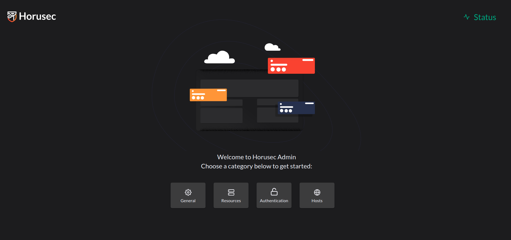
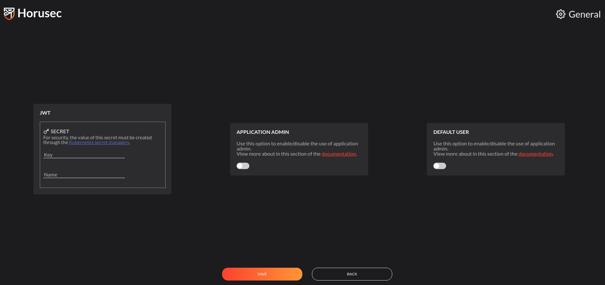
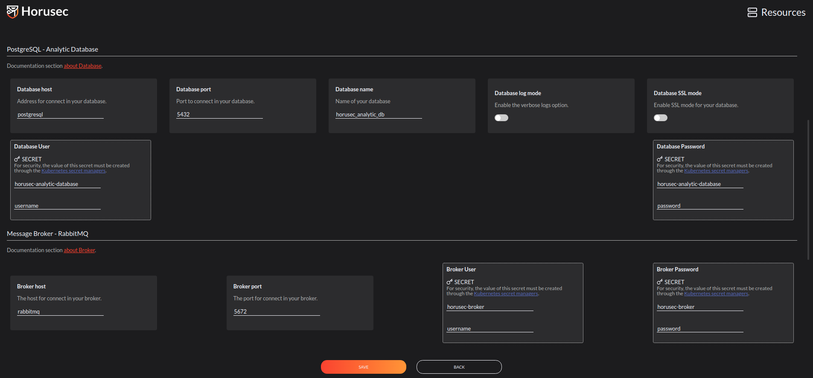

<p></p>
<p></p>
<p align="center" margin="20 0"><a href="https://horusec.io/"></a></p>
<p></p>
<p></p>

<p align="center">
    <a href="https://github.com/ZupIT/horusec-admin/pulse" alt="activity">
        </a>
    <a href="https://github.com/ZupIT/horusec-admin/graphs/contributors" alt="contributors">
        </a>
    <a href="https://github.com/ZupIT/horusec-admin/actions/workflows/lint.yml" alt="lint">
        </a>
    <a href="https://github.com/ZupIT/horusec-admin/actions/workflows/tests.yml" alt="tests">
        </a>
    <a href="https://github.com/ZupIT/horusec-admin/actions/workflows/security.yml" alt="security">
        </a>
    <a href="https://github.com/ZupIT/horusec-admin/actions/workflows/coverage.yml" alt="coverage">
        </a>
    <a href="https://opensource.org/licenses/Apache-2.0" alt="license">
        </a>
</p>

> :warning: **This project will be deprecated in October 2021.** We will leave the repository here in case the community wants to continue its development.

# **Horusec-Admin**
Horusec-admin carries out basic modifications to your Kubernetes cluster through a user-friendly interface.
The creation was based on the conjunction with [**Horusec-Operator**](https://github.com/ZupIT/horusec-operator), where it can have a simpler way to install the services in an environment using Kubernetes.


## **Requirements**
To use Horusec-Admin you need to configure some secrets and dependencies, check them below:
* [**Kubectl**](https://kubernetes.io/docs/tasks/tools/#kubectl) and connection with your cluster
* [**Horusec-Operator**](https://github.com/ZupIT/horusec-operator) installed.

## **Installing Admin**
Install Horusec-Operator in your cluster, see below:

```bash
kubectl apply -f "https://github.com/ZupIT/horusec-operator/releases/download/v2.0.0/horusec-operator.yaml"
```
Check if the resource was installed: 

```bash
kubectl api-resources | grep horus
```
You may see an output like this:
```text
$ kubectl api-resources | grep horus                                                           
horusecplatforms                  horus        install.horusec.io             true         HorusecPlatform
```

Now it is necessary to install Horusec-Admin in your cluster:

```bash
kubectl apply -f "https://github.com/ZupIT/horusec-admin/releases/download/v2.0.0/horusec-admin.yaml"
```

See the pod running: 
```bash
kubectl get pods
```
You may see an output like this:
```text
$ kubectl get pods                                                           
NAME                                                    READY   STATUS      RESTARTS   AGE
horusec-admin-74594694f-sdmr8                           1/1     Running     0          1m
```

## **Usage**

**It is not possible to make changes in Horusec-Operator with a YAML file and you will see this data in Horusec-Admin. We recommend the usage of one project to configure Horusec services. In other words, just the horusec-admin or just horusec-operator**

The Horusec-admin is running in your cluster by default in an internal port HTTP 3000 is necessary to expose in your local machine to access interface this project.

**WARNING! DON'T EXPOSE THIS SERVICE TO EXTERNAL INTERNET BECAUSE CONTAINS SENSITIVE DATA!!!**

Follow the steps to configure: 

1. In your terminal start in port-forward of this service how:
```bash
kubectl port-forward horusec-admin-74594694f-sdmr8 3000:3000
```
If you access `http://localhost:3000` you will see Horusec-Admin page:


2. Get the access token, it is necessary to see the logs of the service because the token was only showed in the internal pod and renewed every 10 minutes. See the follow example:

```bash
kubectl logs pod/horusec-admin-74594694f-sdmr8
```
Your output:

```text
time="2021-06-25 11:29:12 +0000" level=info msg="Token:04cd71a59715bc535cdc3ef6050c4f0ad49f12f0" prefix=authz
time="2021-06-25 11:29:12 +0000" level=info msg="Valid until:2021-06-25 13:29:12.454049573 +0000 UTC m=+7200.016119300" prefix=authz
time="2021-06-25 11:29:12 +0000" level=info msg=listening addr=":3000" prefix=server
```
The token in this case is `04cd71a59715bc535cdc3ef6050c4f0ad49f12f0`


### **When you access internal pages, you can see the following:**

### **Home Page**
Select which configuration you want to perform on the platform:


### **Status Page**
Check the status of the services and if it's available: 


### **General Page**
Perform general application settings such as data for users of the application among others:


### **Resources Page**
Perform connection settings with services as required databases, Message Broker and SMTP:
**Remembering that Horusec does not create these features only accomplishes the connection!**


### **Authentication Page**
Change the type of authentication you want to use in your environment:


### **Hosts Page**
Update simply and quickly the host of your application that will be exposed in the ingress of your Kubbernetes cluster:


## **Development Environment**
This is an example to use Horusec-Admin. Check the requirements: 

- [**Configure horusec-operator**](https://github.com/ZupIT/horusec-operator#development-environment) and all connections and secrets.
- [**Helm**](https://helm.sh/docs/intro/install/#from-script); 
- [**Kind**](https://kind.sigs.k8s.io/docs/user/quick-start/#installation);

After of you install, follow the steps below: 

**Step 1.** Clone horusec-operator project:

```bash
git clone https://github.com/ZupIT/horusec-operator.git && cd horusec-operator
```

**Step 2.** Up kubernetes cluster with all dependencies and wait to finish:

```bash
make up-sample
```

If you see this message:

```text
Creating horusec_analytic_db...
If you don't see a command prompt, try pressing enter.
psql: could not connect to server: Connection refused
        Is the server running on host "postgresql" (10.96.182.42) and accepting
        TCP/IP connections on port 5432?
pod "postgresql-client" deleted
pod default/postgresql-client terminated (Error)
```
Don't worry this is normal because the script is trying create new database, but the pod of the postgresql is not ready, it will run again until create new database.

**Step 3.** After the script finishes, install Horusec-Operator:

```bash
kubectl apply -f "https://github.com/ZupIT/horusec-operator/releases/download/v2.0.0/horusec-operator.yaml"
```

**Step 4.** Check if the resource was installed:

```bash
kubectl api-resources | grep horus
```
You may see an output like this:

```text
$ kubectl api-resources | grep horus                                                           
horusecplatforms                  horus        install.horusec.io             true         HorusecPlatform
```

And you can see the pod manager by this resource:
```text
$ kubectl get pods -n horusec-operator-system
NAME                                                   READY   STATUS              RESTARTS   AGE
horusec-operator-controller-manager-7b9696d4c4-t7w2q   2/2     Running             0          2m10s
```

**Step 5.** Now, install horusec-admin in your cluster:

```bash
kubectl apply -f "https://github.com/ZupIT/horusec-admin/releases/download/v2.0.0/horusec-admin.yaml"
```

See the pod running:

```bash
kubectl get pods
```
You may see an output like this:
```text
$ kubectl get pods                                                           
NAME                                                    READY   STATUS      RESTARTS   AGE
horusec-admin-74594694f-sdmr8                           1/1     Running     0          1m
```

**Step 6.** Now in your terminal, start in port-forward of this service:

```bash
kubectl port-forward horusec-admin-74594694f-sdmr8 3000:3000
```
If you access `http://localhost:3000` you will see horusec-admin page.


**Step 7.** Get the access token. See the logs of the service because the token was showed only in the internal pod and renewed every 10 minutes. See follow example:

```bash
kubectl logs pod/horusec-admin-74594694f-sdmr8
```
And your output may be:
```text
time="2021-06-25 11:29:12 +0000" level=info msg="Token:04cd71a59715bc535cdc3ef6050c4f0ad49f12f0" prefix=authz
time="2021-06-25 11:29:12 +0000" level=info msg="Valid until:2021-06-25 13:29:12.454049573 +0000 UTC m=+7200.016119300" prefix=authz
time="2021-06-25 11:29:12 +0000" level=info msg=listening addr=":3000" prefix=server
```

The token in this case is `04cd71a59715bc535cdc3ef6050c4f0ad49f12f0`.

**Step 8.** Setup the authentication. Go to the general page and **click on "Save" button**, and all Horusec services will upload with default configuration. You can see with command:

```bash
kubectl get pods
```
The output will be like this:

```text
$ kubectl get pods
NAME                                                    READY   STATUS      RESTARTS   AGE
horusec-admin-74594694f-sdmr8                           1/1     Running     0          5m
analytic-6f6bffb5d6-f8pl9                               1/1     Running     0          74s
api-5cc5b7545-km925                                     1/1     Running     0          73s
auth-8fbc876d9-62r6d                                    1/1     Running     0          73s
core-6bf7f9c9fc-fdv5c                                   1/1     Running     0          73s
horusecplatform-sample-analytic-migration-wwdzc-r9th2   0/1     Completed   0          74s
horusecplatform-sample-analytic-v1-2-v2-8zchl-445mz     0/1     Completed   2          74s
horusecplatform-sample-api-v1-2-v2-5lndp-w2rbd          0/1     Completed   3          74s
horusecplatform-sample-platform-migration-8g5ml-zmntl   0/1     Completed   0          74s
manager-c959f4f67-fz7r4                                 1/1     Running     0          74s
postgresql-postgresql-0                                 1/1     Running     0          7m54s
rabbitmq-0                                              1/1     Running     0          7m54s
vulnerability-7d789fd655-tpjp8                          1/1     Running     0          74s
webhook-7b5c45c859-cq4nf                                1/1     Running     0          73s
```

## **Documentation**

For more information about Horusec, please check out the [**documentation**](https://horusec.io/docs/).


## **Contributing**

If you want to contribute to this repository, access our [**Contributing Guide**](https://github.com/ZupIT/charlescd/blob/main/CONTRIBUTING.md). 
And if you want to know more about Horusec, check out some of our other projects:


- [**Charts**](https://github.com/ZupIT/charlescd/tree/main/circle-matcher)
- [**Devkit**](https://github.com/ZupIT/horusec-devkit)
- [**Engine**](https://github.com/ZupIT/horusec-engine)
- [**Jenkins**](https://github.com/ZupIT/horusec-jenkins-sharedlib)
- [**Operator**](https://github.com/ZupIT/horusec-operator)
- [**Platform**](https://github.com/ZupIT/horusec-platform)
- [**VSCode plugin**](https://github.com/ZupIT/horusec-vscode-plugin)
- [**Kotlin**](https://github.com/ZupIT/horusec-tree-sitter-kotlin)
- [**Vulnerabilities**](https://github.com/ZupIT/horusec-examples-vulnerabilities)

## **Community**
Feel free to reach out to us at:

- [**GitHub Issues**](https://github.com/ZupIT/horusec-devkit/issues)
- [**Zup Open Source Forum**](https://forum.zup.com.br)


This project exists thanks to all the contributors. You rock! ❤️🚀
